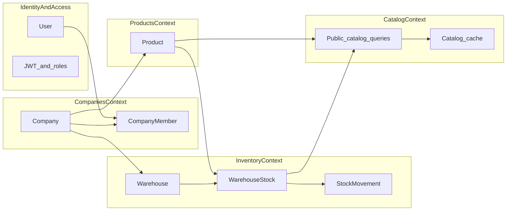

# DDD-огляд та зв’язки

Документацію розбито на **bounded contexts** (обмежені контексти): кожен файл описує власні сутності та те, як вони взаємодіють з іншими через застосункові команди/квері та HTTP API.

## Зміст

| Файл | Контекст |
|------|-----------|
| [IdentityAndAccess.md](IdentityAndAccess.md) | Користувач, JWT, глобальні ролі, акаунт, 2FA |
| [CompaniesContext.md](CompaniesContext.md) | Компанія, членство, компанійні ролі, модерація |
| [CatalogContext.md](CatalogContext.md) | Публічний каталог, кеш, категорії |
| [ProductsContext.md](ProductsContext.md) | Товари компанії та вітрина |
| [InventoryContext.md](InventoryContext.md) | Склади, залишки, рухи, резерви |
| [BusinessFlows.md](BusinessFlows.md) | Словами: типові сценарії end-to-end |
| [RoleAccessMatrix.md](RoleAccessMatrix.md) | Матриця «роль → що доступно» |
| [TestEntitiesAndScenarios.md](TestEntitiesAndScenarios.md) | Тестові дані та покрокові сценарії |

## Залежності між контекстами (спрощена схема)

## Де дивитись код

- **HTTP:** `Marketplace.API/Controllers`
- **Use cases:** `Marketplace.Application/**/Commands|Queries`
- **Домен:** `Marketplace.Domain/**`
- **Права на рівні компанії:** `ProductAccessService`, `InventoryAccessService`, `CompanyPermissions`
