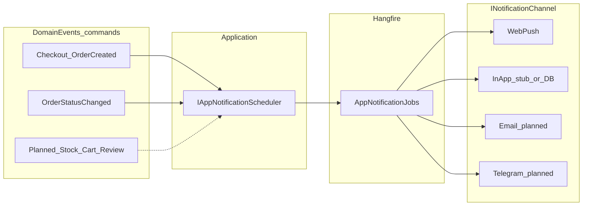

# Застосункові нотифікації (огляд)

Ця підпапка описує **цільову** багатоканальну модель сповіщень (Web Push, майбутній in-app, email, Telegram) і **матрицю ролей/подій**. У кожному файлі явно розділено **«реалізовано в коді»** та **«план / дизайн»**.

## Етап 0 — правило розділення (обов’язково для всієї команди) {#notifications-stage0}

**Що куди:**

| Потік | Інтерфейс / вхідна точка | Дозволено |
|-------|---------------------------|-----------|
| **Акаунт і безпека** | `INotificationDispatcher` → Hangfire `NotificationJobs` | Лише: підтвердження email, скидання пароля, коди 2FA (email), повідомлення Telegram/SMS **в рамках auth** |
| **Маркетплейс** (замовлення, кошик, каталог, модерація тощо) | `IAppNotificationScheduler` → Hangfire `AppNotificationJobs` → `INotificationChannel` | Усі застосункові події; окремі канали (Push, In-app; згодом email/Telegram **як нові класи каналів**, а не нові методи в auth-диспетчері) |

**Золоте правило:** не додавати в `INotificationDispatcher` методи на кшталт «нове замовлення», «статус замовлення», «товар у наявності» — це змішує домени й ускладнює тестування. Для листів/Telegram по **бізнес-подіях** після імплементації використовувати **`INotificationChannel`** (див. [Channels.md](Channels.md)), які можуть викликати той самий `IEmailPort` / `ITelegramPort`, але **не** розширюють контракт auth-диспетчера.

Деталі конфігурації Web Push і PII: [ConfigurationAndSecurity.md](ConfigurationAndSecurity.md).

## Навігація по документах

| Документ | Призначення |
|----------|-------------|
| [Architecture.md](Architecture.md) | Шари, порти, Hangfire, розширення каналів, зв’язок з outbox (фаза 2) |
| [Channels.md](Channels.md) | Web Push, in-app, email, Telegram — стан і план |
| [ServiceWorkerAndWebPush.md](ServiceWorkerAndWebPush.md) | Next.js / Service Worker, підписка, обмеження |
| [EventCatalog.md](EventCatalog.md) | Каталог подій: аудиторія, канали, статус |
| [RoleAndAudienceMatrix.md](RoleAndAudienceMatrix.md) | Глобальні та компанійні ролі → канали та audience |
| [ConfigurationAndSecurity.md](ConfigurationAndSecurity.md) | Конфіг, секрети, PII, opt-in |
| [ImplementationRoadmap.md](ImplementationRoadmap.md) | Порядок виконання робіт за цією документацією (етапи 0–7) |

## Швидкі посилання

- HTTP для Web Push підписок: [Endpoints/PushNotifications.md](../Endpoints/PushNotifications.md)
- HTTP для in-app списку та прочитання: [Endpoints/MeNotifications.md](../Endpoints/MeNotifications.md)
- Матриця доступів API за ролями: [RoleAccessMatrix.md](../DDD/RoleAccessMatrix.md)
- Поточний флоу Web Push у бізнес-подіях: [BusinessFlows.md §8](../DDD/BusinessFlows.md)

## Потік даних (спрощено)

Два паралельні світи:

1. **Auth / акаунт** — `INotificationDispatcher` у `Marketplace.Application/Auth/Ports` (email, Telegram, SMS) через Hangfire `NotificationJobs` у `Marketplace.Infrastructure/Jobs`. Не змішувати з застосунковими подіями замовлень тощо.
2. **Застосунок** — `IAppNotificationScheduler` → Hangfire `AppNotificationJobs` → набір `INotificationChannel` (`Marketplace.Application/Notifications`, `Marketplace.Infrastructure/Jobs` та `Infrastructure/Notifications`).

## Термінологія

- **Шаблон** (`TemplateKey` у `AppNotificationRequest`) — ключ для побудови title/body/url у `AppNotificationPayloadBuilder` (`Marketplace.Infrastructure/Notifications`).
- **Аудиторія** — кому адресовано (`Admins`, `User` + `TargetUserId`); для Web Push додатково прапорці підписки в БД (`UserWebPush`, `AdminWebPush`).
- **Канал** — спосіб доставки (`Push`, `InApp`; пізніше email/TG як окремі канали).
