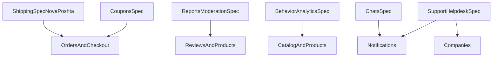

# 07 - Cross-Domain Rollout Plan

## 1. Execution order

Рекомендована послідовність релізу:

1. Shipping (P0)
2. Coupons + Reports (P1, паралельно)
3. Behavior/Analytics (P1)
4. Chats (P2)
5. Support (P2, з зовнішнім helpdesk)

## 2. Dependency map

## 3. Milestones and release gates

### Milestone A - Shipping foundation

- schema + repositories + address API;
- shipping quote + checkout selection;
- Nova Poshta adapter + webhook;
- `shipping-gate` green.

### Milestone B - Commerce and moderation

- coupons apply/consume;
- reports queue + moderation actions;
- `coupons-gate` і `reports-gate` green.

### Milestone C - Data and engagement

- behavior event ingestion + KPI APIs;
- chats send/read/moderation;
- `behavior-analytics-gate` і `chats-gate` green.

### Milestone D - Support federation

- internal ticketing baseline;
- external helpdesk bidirectional sync;
- `support-gate` green + reconciliation job smoke.

## 4. Common production gates (for every domain)

- Domain gate (`Suite=<Domain>`): Unit + IntegrationLight.
- Coverage threshold >= 12% для профільного gate.
- Security checks:
  - authz regression tests;
  - webhook signing verification;
  - rate-limit behavior.
- `integration-full`:
  - IntegrationContainers;
  - E2E for core user path.

## 5. Shared non-functional requirements

### Availability and latency

- p95 latency core write endpoint-ів не вище цільового бюджету.
- error-rate алерти для кожного нового домену.

### Data and privacy

- PII redaction policy в telemetry.
- retention policy на domain data/events/messages.

### Reliability

- outbox/inbox або idempotency policy на critical writes.
- retries + DLQ + replay procedure для зовнішніх інтеграцій.

## 6. Cross-domain incident ownership

- Shipping/Coupons/Reports/Chats/Support мають явних owner-ів у on-call rota.
- Incident severity policy:
  - Sev1: checkout/shipping/support critical outage;
  - Sev2: moderation backlog/SLA breach;
  - Sev3: degraded analytics/chats features.

## 7. Rollout checkpoints

Кожний етап переходить у наступний лише якщо:

- є зелені CI gates;
- є production smoke результат;
- є оновлений runbook;
- є rollback plan, перевірений dry-run або staging тестом.
