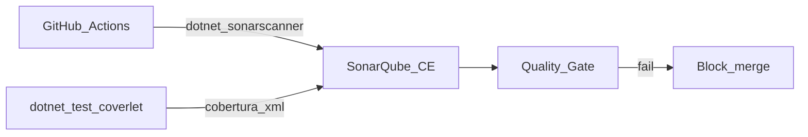

# 01 — SonarQube Community Edition

## 1. Scope & non-goals

**Scope:** self-hosted SonarQube CE для статичного аналізу C#, import coverage з Coverlet, Quality Gate у CI.

**Non-goals:** SonarCloud (окремий SaaS), branch analysis як у Commercial, аналіз frontend.

## 2. As-is

- Немає `sonar-project.properties`, Sonar у Docker, scanner у GitHub Actions.
- Coverage лише через Coverlet у [`.github/workflows/backend-ci.yml`](../../.github/workflows/backend-ci.yml).

## 3. To-be



- Окремий PostgreSQL для Sonar (не `marketplace` DB).
- Проєкт `marketplace-backend`.
- CE workaround для гілок: `sonar.branch.name` + New Code Period.

## 4. Покрокова інтеграція

### 4.1 Локально (Docker Compose profile `sonar`)

```powershell
docker compose -f docker-compose.dev.yml -f docker-compose.monitoring.yml --profile sonar up -d
```

1. Відкрити `http://localhost:9002`, логін `admin` / `admin` (змінити пароль).
2. Створити token: My Account → Security → Generate Token.
3. Задати `SONAR_TOKEN` локально.

### 4.2 Перший аналіз (локально)

Скрипт (рекомендовано): [`backend/scripts/sonar-scan.ps1`](../../backend/scripts/sonar-scan.ps1) або [`sonar-scan.sh`](../../backend/scripts/sonar-scan.sh) — begin → build → test (cobertura) → end → quality gate API.

Вручну:

```powershell
cd backend
$env:SONAR_TOKEN = "<token>"
dotnet tool install --global dotnet-sonarscanner
dotnet sonarscanner begin /k:"marketplace-backend" /d:sonar.host.url="http://localhost:9002" /d:sonar.token=$env:SONAR_TOKEN
dotnet build Marketplace.slnx -c Release
dotnet test tests/Marketplace.Tests/Marketplace.Tests.csproj -c Release --no-build /p:CollectCoverage=true /p:CoverletOutput=./test-results/sonar-coverage/ /p:CoverletOutputFormat=cobertura
dotnet sonarscanner end /d:sonar.token=$env:SONAR_TOKEN
```

### 4.3 CI

Див. [08-ci-cd-integration.md](08-ci-cd-integration.md) — job `sonar-analysis` (self-hosted runner або URL доступний з GitHub).

### 4.4 Quality Gate

Пороги: [appendices/sonar-quality-profile.md](appendices/sonar-quality-profile.md).

## 5. Конфігурація

Файл: [`backend/sonar-project.properties`](../../backend/sonar-project.properties)

Ключові властивості:

```properties
sonar.projectKey=marketplace-backend
sonar.projectName=Marketplace Backend
sonar.sources=src
sonar.tests=tests
sonar.cs.analyzer.projectOutPaths=**/bin/**,**/obj/**
sonar.coverageReportPaths=test-results/sonar-coverage/coverage.cobertura.xml
sonar.exclusions=**/Migrations/**,**/bin/**,**/obj/**,**/Contracts/**
```

## 6. Безпека

- Sonar DB credentials лише в Compose env / secrets manager.
- Token rotation кожні 90 днів.
- Sonar UI не публікувати в internet без reverse proxy + auth.

## 7. CI/CD

| Job | Блокує merge? | Умова |
|-----|---------------|-------|
| `sonar-analysis` | Так (якщо `SONAR_HOST_URL` заданий) | Quality Gate failed |

Fork PR без secrets — job `if: secrets.SONAR_TOKEN != ''`.

## 8. Верифікація

- Dashboard Sonar показує 4 modules + tests.
- Coverage > 0% після test step.
- Quality Gate green на `main`.

## 9. Rollback / troubleshooting

| Симптом | Дія |
|---------|-----|
| Scanner timeout | Збільшити `sonar.scanner.scanAll=false` для великих diff |
| Coverage 0% | Перевірити шлях `sonar.coverageReportPaths` |
| CE branch warning | Ігнорувати branch decoration; використовувати New Code |

## 10. Definition of Done

- [x] `sonar-project.properties` у репо.
- [x] Compose profile `sonar` працює локально.
- [x] CI job з merge cobertura + scanner end + wait-for-quality-gate.
- [x] Quality Gate зафіксований у appendix.
