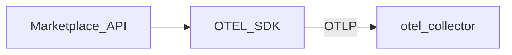

# 03 — OpenTelemetry .NET SDK

## 1. Scope & non-goals

**Scope:** metrics, traces, logs bridge, resource, sampling, OTLP export з `Marketplace.API`.

**Non-goals:** Прямий Prometheus scrape з API в production.

## 2. As-is

[`ServiceCollectionExtensions.cs`](../../backend/src/Marketplace.API/Extensions/ServiceCollectionExtensions.cs):

```csharp
services.AddOpenTelemetry()
    .WithMetrics(metrics => metrics
        .AddAspNetCoreInstrumentation()
        .AddHttpClientInstrumentation()
        .AddRuntimeInstrumentation()
        .AddMeter(MarketplaceMetrics.MeterName)
        .AddPrometheusExporter());
```

[`Program.cs`](../../backend/src/Marketplace.API/Program.cs): `MapPrometheusScrapingEndpoint("/metrics")` + Admin role.

## 3. To-be



Signals: **metrics + traces** (logs optional via `OpenTelemetryLoggerProvider`).

## 4. Покрокова інтеграція

### 4.1 NuGet (API project)

| Package | Призначення |
|---------|-------------|
| `OpenTelemetry.Exporter.OpenTelemetryProtocol` | OTLP export |
| `OpenTelemetry.Instrumentation.EntityFrameworkCore` | DB spans |
| `OpenTelemetry.Instrumentation.StackExchangeRedis` | Redis |
| (existing) AspNetCore, Http, Runtime, Hosting | Base |

### 4.2 Реєстрація (логіка)

1. `ConfigureOpenTelemetry` extension у `Marketplace.API/Extensions/OpenTelemetryExtensions.cs`.
2. Умова `OpenTelemetry:Enabled` (default `true` у dev з collector).
3. **Metrics:** існуючі instrumentations + `AddOtlpExporter` для metrics pipeline.
4. **Traces:** `AddAspNetCoreInstrumentation` з filter (skip `/health`, `/metrics`, `/swagger`).
5. **Traces:** `AddEntityFrameworkCoreInstrumentation`, `AddHttpClientInstrumentation`.
6. **Resource:** `AddService("marketplace-api")` + `deployment.environment`.
7. **Custom ActivitySource:** `Marketplace.Telemetry` для checkout, webhook, outbox, Hangfire wrappers.

### 4.3 Custom spans (без PII)

Дозволені tags: `operation`, `company_id` (UUID), `order_id`, `job`, `provider`, `channel`.

Заборонені: `email`, `phone`, `authorization`, raw SQL.

### 4.4 Legacy `/metrics`

`Observability:EnableLegacyPrometheusEndpoint` — `false` за замовчуванням; `true` лише для локальної відладки без Collector.

### 4.5 Sampling

| Env | Policy |
|-----|--------|
| Development | `AlwaysOn` |
| Staging | `ParentBased(root=TraceIdRatioBased(0.5))` |
| Production | `ParentBased(root=TraceIdRatioBased(0.1))` + tail sampling на Collector |

## 5. Конфігурація

`appsettings.json`:

```json
{
  "OpenTelemetry": {
    "Enabled": true,
    "ServiceName": "marketplace-api",
    "OtlpEndpoint": "http://otel-collector:4317",
    "OtlpProtocol": "grpc",
    "EnableLegacyPrometheusEndpoint": false,
    "TraceSamplingRatio": 1.0
  }
}
```

Env override (стандарт OTEL):

| Env | Приклад |
|-----|---------|
| `OTEL_EXPORTER_OTLP_ENDPOINT` | `http://otel-collector:4317` |
| `OTEL_EXPORTER_OTLP_PROTOCOL` | `grpc` |
| `OTEL_SERVICE_NAME` | `marketplace-api` |
| `OTEL_RESOURCE_ATTRIBUTES` | `deployment.environment=development` |

## 6. Безпека

- `Filter` на AspNetCore: не записувати query string з tokens.
- EF: `SetDbStatementForText = false` у production (лише operation name).

## 7. CI/CD

Build має проходити з новими пакетами; optional smoke test — див. [08](08-ci-cd-integration.md).

## 8. Верифікація

1. Запустити `docker compose -f docker-compose.dev.yml -f docker-compose.monitoring.yml --profile observability up -d`.
2. Викликати API endpoints.
3. Jaeger: service `marketplace-api`, spans `GET /api/...`.
4. Prometheus: series `http_server_request_duration_*` через collector metric rename.

## 9. Rollback

- `OpenTelemetry:Enabled=false`.
- Видалити OTLP exporter — залишити лише Prometheus exporter (legacy).

## 10. Definition of Done

- [x] OTLP metrics + traces + logs на Collector.
- [x] EF + Redis instrumentation.
- [x] Legacy endpoint за feature flag (`EnableLegacyPrometheusEndpoint`).
- [x] `MarketplaceTelemetry` ActivitySource + custom spans (trace-span-catalog).
