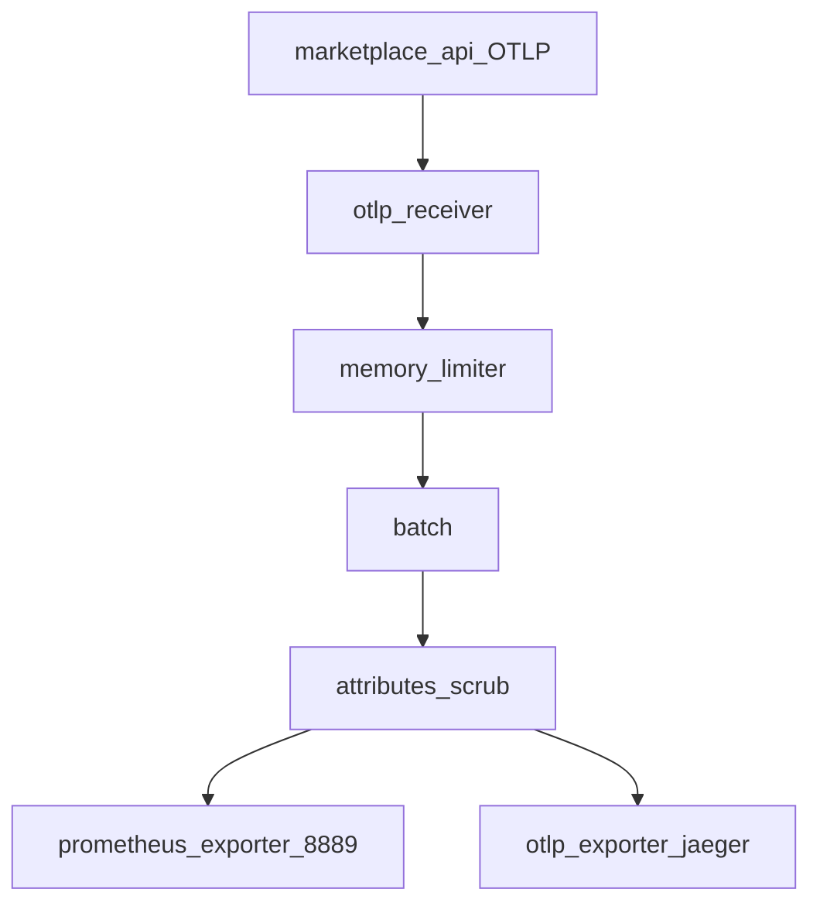

# 04 — OpenTelemetry Collector

## 1. Scope & non-goals

**Scope:** центральний хаб OTLP → Prometheus + Jaeger; scrubbing PII headers.

**Non-goals:** Збір логів у Loki (optional пізніше).

## 2. As-is

Файл конфігурації відсутній; API експортує Prometheus напряму.

## 3. To-be

Конфіг: [`observability/otel-collector-config.yaml`](../../observability/otel-collector-config.yaml)



## 4. Покрокова інтеграція

1. Створити `observability/otel-collector-config.yaml`.
2. Додати сервіс `otel-collector` у `docker-compose.yml` profile `observability`.
3. Image: `otel/opentelemetry-collector-contrib:0.96.0` (або latest LTS).
4. Порти: `4317` gRPC, `4318` HTTP, `8889` Prometheus exporter, `13133` health.
5. `api` depends_on `otel-collector`; env `OTEL_EXPORTER_OTLP_ENDPOINT=http://otel-collector:4317`.

## 5. Конфігурація

Основні секції:

```yaml
receivers:
  otlp:
    protocols:
      grpc:
        endpoint: 0.0.0.0:4317
      http:
        endpoint: 0.0.0.0:4318

processors:
  memory_limiter:
    check_interval: 1s
    limit_mib: 512
  batch:
    timeout: 5s
  attributes/scrub:
    actions:
      - key: http.request.header.authorization
        action: delete
      - key: http.request.header.cookie
        action: delete

exporters:
  prometheus:
    endpoint: 0.0.0.0:8889
  otlp/jaeger:
    endpoint: jaeger:4317
    tls:
      insecure: true

service:
  pipelines:
    metrics:
      receivers: [otlp]
      processors: [memory_limiter, batch]
      exporters: [prometheus]
    traces:
      receivers: [otlp]
      processors: [memory_limiter, attributes/scrub, batch]
      exporters: [otlp/jaeger]
```

## 6. Безпека

- Не expose `4317`/`8889` на public host у prod — internal network only.
- mTLS між API і Collector на staging/prod — [10-staging-production-rollout.md](10-staging-production-rollout.md).

## 7. CI/CD

```yaml
observability-config-validate:
  steps:
    - run: docker run --rm -v ${{ github.workspace }}/observability:/cfg otel/opentelemetry-collector-contrib:0.96.0 validate --config=/cfg/otel-collector-config.yaml
```

## 8. Верифікація

```powershell
curl http://localhost:13133/
curl http://localhost:8889/metrics | Select-String marketplace
```

## 9. Rollback

Зупинити collector — API продовжить працювати (exporter errors у logs, не crash).

## 10. Definition of Done

- [x] Config у репо + validate в CI (`observability-config-validate`).
- [x] Compose service healthy (`--profile observability`).
- [x] Prometheus scrape `otel-collector:8889`.
