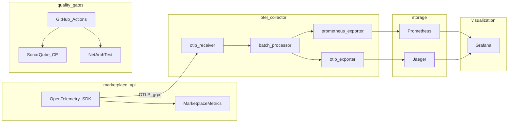

# Platform Engineering: Observability + SQA

Детальні плани інтеграції якості коду та спостережуваності для **Marketplace backend** (.NET 10, DDD/Hexagonal).

## Архітектура (цільовий стан)

**Ключове рішення:** метрики з API експортуються через **OTLP → Collector → Prometheus** (не прямий scrape `GET /metrics` з Admin JWT).

## Документація

| Файл | Тема |
|------|------|
| [00-target-state-and-principles.md](00-target-state-and-principles.md) | RED/USE, SLI/SLO, безпека, non-goals |
| [01-sonarqube-community-edition.md](01-sonarqube-community-edition.md) | SonarQube CE, scanner, quality gate |
| [02-netarchtest-layer-rules.md](02-netarchtest-layer-rules.md) | NetArchTest (не JVM ArchUnit), ARCH-01..07 |
| [03-opentelemetry-dotnet-sdk.md](03-opentelemetry-dotnet-sdk.md) | Metrics, traces, logs, sampling |
| [04-opentelemetry-collector.md](04-opentelemetry-collector.md) | Collector pipelines |
| [05-prometheus.md](05-prometheus.md) | Scrape, recording rules, retention |
| [06-jaeger-distributed-tracing.md](06-jaeger-distributed-tracing.md) | Traces, propagation, spans |
| [07-grafana-dashboards-alerts.md](07-grafana-dashboards-alerts.md) | Dashboards, alerting |
| [08-ci-cd-integration.md](08-ci-cd-integration.md) | GitHub Actions jobs |
| [09-local-docker-compose-runbook.md](09-local-docker-compose-runbook.md) | Локальний стек |
| [10-staging-production-rollout.md](10-staging-production-rollout.md) | Staging/prod |
| [appendices/metrics-catalog.md](appendices/metrics-catalog.md) | Каталог метрик |
| [appendices/trace-span-catalog.md](appendices/trace-span-catalog.md) | Каталог spans |
| [appendices/sonar-quality-profile.md](appendices/sonar-quality-profile.md) | Sonar Quality Gate |

## Матриця компонент → репозиторій → CI

| Компонент | Код / конфіг | CI job | Документ |
|-----------|--------------|--------|----------|
| Custom metrics | `backend/src/Marketplace.Infrastructure/Observability/MarketplaceMetrics.cs` | domain gates | [metrics-catalog](appendices/metrics-catalog.md) |
| OTEL SDK | `backend/src/Marketplace.API/Extensions/ServiceCollectionExtensions.cs` | build | [03](03-opentelemetry-dotnet-sdk.md) |
| Collector | `observability/otel-collector-config.yaml` | `observability-config-validate` | [04](04-opentelemetry-collector.md) |
| Prometheus | `observability/prometheus.yml` | `observability-config-validate` | [05](05-prometheus.md) |
| Jaeger | `docker-compose.yml` profile `observability` | — | [06](06-jaeger-distributed-tracing.md) |
| Grafana | `observability/grafana/provisioning/` | — | [07](07-grafana-dashboards-alerts.md) |
| NetArchTest | `backend/tests/.../Architecture/ArchitectureTests.cs` | `architecture-gate` | [02](02-netarchtest-layer-rules.md) |
| SonarQube | `backend/sonar-project.properties` | `sonar-analysis` | [01](01-sonarqube-community-edition.md) |

## Пов’язані документи в репо

- Операційний runbook (бізнес-SLI): [backend/src/Marketplace.API/Docs/DDD/ObservabilityRunbook.md](../../backend/src/Marketplace.API/Docs/DDD/ObservabilityRunbook.md)
- Матриця шарів: [backend/ARCHITECTURE_DECISION_MATRIX.md](../../backend/ARCHITECTURE_DECISION_MATRIX.md)
- Production readiness: [reports/production-readiness/](../../reports/production-readiness/)

## Фази імплементації

1. **Документація** — цей каталог (`docs/platform-engineering/`).
2. **Інфра** — `observability/`, Compose profiles `observability` + `sonar`.
3. **SDK** — OTLP metrics/traces, EF/Redis instrumentation.
4. **Візуалізація** — Grafana provisioning.
5. **Якість** — NetArchTest + Sonar у CI.
