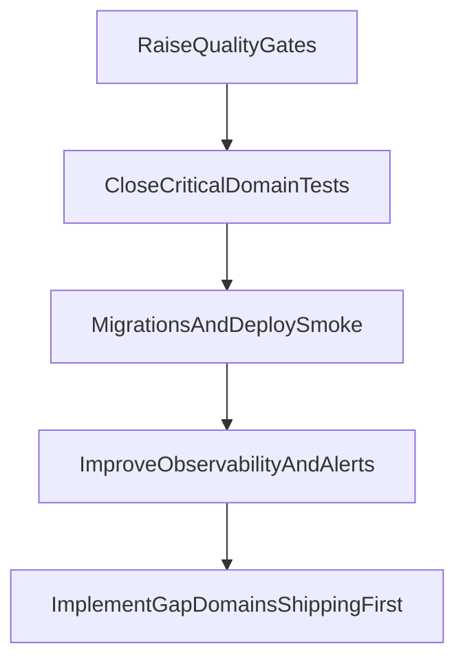

# Backend Production Readiness Audit

Аудит backend-доменів Marketplace з оцінкою готовності до продакшену, переліком блокерів і рекомендованою чергою робіт.

## Як читати цей звіт

- Методика оцінювання: [scoring-methodology.md](./scoring-methodology.md)
- Карта доменів: [domain-map.md](./domain-map.md)
- Gap-домени і пропозиції: [domain-gaps-and-proposals.md](./domain-gaps-and-proposals.md)

## Зведений рейтинг доменів

| Домен | Готовність |
|---|---:|
| Identity & Access | 100/100 |
| Catalog & Categories | 100/100 |
| Cart & Checkout | 100/100 |
| Products & Moderation | 100/100 |
| Companies & Workspace | 100/100 |
| Inventory | 100/100 |
| Orders | 100/100 |
| Platform (Outbox/Idempotency/Jobs/Observability) | 100/100 |
| Favorites | 100/100 |
| Payments | 100/100 |
| Reviews | 100/100 |
| Notifications | 100/100 |

Орієнтовна сумарна готовність реалізованого ядра backend: **~100/100**.

## Домени і детальні звіти

- [domain-identity-access.md](./domain-identity-access.md)
- [domain-companies-workspace.md](./domain-companies-workspace.md)
- [domain-catalog-categories.md](./domain-catalog-categories.md)
- [domain-products-moderation.md](./domain-products-moderation.md)
- [domain-inventory.md](./domain-inventory.md)
- [domain-cart-checkout.md](./domain-cart-checkout.md)
- [domain-favorites.md](./domain-favorites.md)
- [domain-orders.md](./domain-orders.md)
- [domain-payments.md](./domain-payments.md)
- [domain-reviews.md](./domain-reviews.md)
- [domain-notifications.md](./domain-notifications.md)
- [domain-platform.md](./domain-platform.md)

## Топ-5 критичних доробок перед production

1. Підняти global `unit-coverage-gate` threshold вище `8%` для сталого quality baseline.
2. Додати migration/deploy smoke у CI для раннього виявлення schema drift.
3. Формалізувати production secrets/config policy (`JWT`, `LiqPay`, `VAPID`, email/telegram/storage).
4. Посилити distributed tracing і operational dashboards для критичних потоків (payments/outbox/reviews).
5. Продовжити hardening anti-abuse та anomaly-detection шарів (reviews/notifications/payments).

## Roadmap до production-ready

## Додатково: які домени додати

Рекомендований порядок реалізації нових/неповних доменів:

1. Shipping (P0)
2. Coupons (P1)
3. Reports (P1)
4. Behavior/Analytics (P1)
5. Chats (P2)
6. Support (P2)

Деталі: [domain-gaps-and-proposals.md](./domain-gaps-and-proposals.md)
