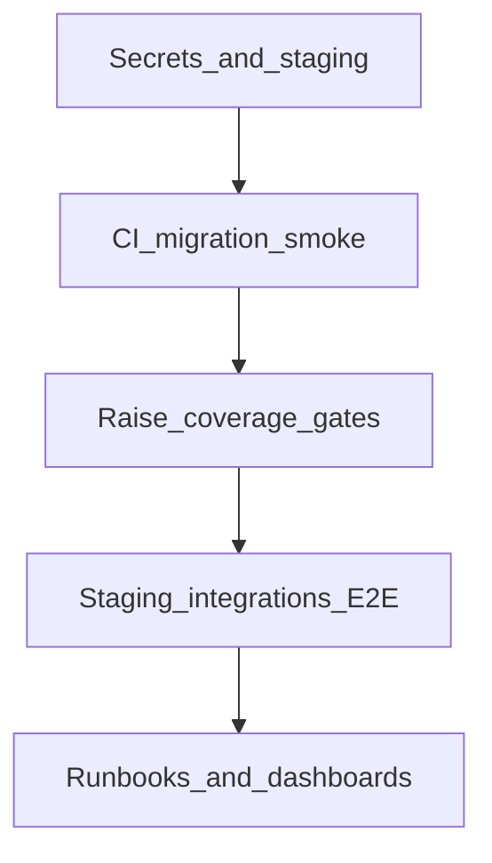

# Backend Production Readiness Audit

Аудит backend Marketplace: оцінка готовності до продакшену, blockers і roadmap.

**Останнє оновлення:** 2026-06-29  
**P0 закрито:** 2026-06-29  
**Загальний score:** **89/100** — **Ready** (controlled MVP)  
**Executive summary:** [executive-production-readiness.md](./executive-production-readiness.md)

## Як читати цей звіт

- Методика: [scoring-methodology.md](./scoring-methodology.md)
- Карта доменів: [domain-map.md](./domain-map.md)
- Gap-аналіз: [domain-gaps-and-proposals.md](./domain-gaps-and-proposals.md)
- Докази прогонів: [evidence/](./evidence/)

## Наскрізні звіти

| Напрям | Score | Файл |
|--------|------:|------|
| Infrastructure & services | 90 | [infrastructure-services-readiness.md](./infrastructure-services-readiness.md) |
| External integrations | 83 | [external-integrations-readiness.md](./external-integrations-readiness.md) |
| Security | 88 | [security-readiness.md](./security-readiness.md) |
| Testing & quality | 88 | [testing-quality-readiness.md](./testing-quality-readiness.md) |
| DevOps / CI-CD | 84 | [devops-cicd-readiness.md](./devops-cicd-readiness.md) |

## Зведений рейтинг доменів

| Домен | Готовність |
|---|---:|
| Platform (Outbox/Jobs/Observability) | 91/100 |
| Cart & Checkout | 90/100 |
| Orders | 89/100 |
| Identity & Access | 88/100 |
| Inventory | 88/100 |
| Payments | 88/100 |
| Products & Moderation | 87/100 |
| Catalog & Categories | 86/100 |
| Reviews | 86/100 |
| Companies & Workspace | 85/100 |
| Notifications | 85/100 |
| Analytics & Recommendations | 84/100 |
| Favorites | 84/100 |
| Coupons | 83/100 |
| Shipping | 85/100 |
| Returns | 81/100 |
| Reports (moderation) | 80/100 |
| Chats | 78/100 |
| Support | 72/100 |

**Середнє по доменах:** ~84/100

## Доменні звіти

### Ядро (оригінальний аудит)

- [domain-identity-access.md](./domain-identity-access.md)
- [domain-companies-workspace.md](./domain-companies-workspace.md)
- [domain-catalog-categories.md](./domain-catalog-categories.md)
- [domain-products-moderation.md](./domain-products-moderation.md)
- [domain-inventory.md](./domain-inventory.md)
- [domain-cart-checkout.md](./domain-cart-checkout.md)
- [domain-favorites.md](./domain-favorites.md)
- [domain-orders.md](./domain-orders.md)
- [domain-payments.md](./domain-payments.md)
- [domain-reviews.md](./domain-reviews.md)
- [domain-notifications.md](./domain-notifications.md)
- [domain-platform.md](./domain-platform.md)

### Розширення (2026-06)

- [domain-shipping.md](./domain-shipping.md)
- [domain-coupons.md](./domain-coupons.md)
- [domain-returns.md](./domain-returns.md)
- [domain-reports-moderation.md](./domain-reports-moderation.md)
- [domain-chats.md](./domain-chats.md)
- [domain-support.md](./domain-support.md)
- [domain-analytics-recommendations.md](./domain-analytics-recommendations.md)

## Топ-5 наступних кроків (P2)

1. **Coverage Phase B/C** — global 15% → 25%+.
2. **Full CD** to registry/K8s.
3. **Support public API** completion.
4. **DAST** / penetration test у staging.
5. **Mutation testing** на payment/checkout handlers.

## Roadmap

## Тестовий контур (evidence 2026-06-29)

- Unit: 443 passed
- Integration Light: 50 passed
- Containers: 32 passed (Postgres, Redis, ES, MinIO, ClickHouse)
- E2E: 35 passed

Деталі: [evidence/coverage-matrix-summary.md](./evidence/coverage-matrix-summary.md)
