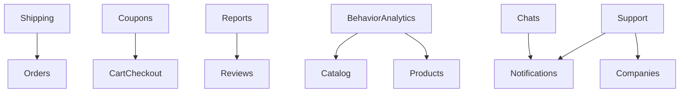

# Gap Domains and Proposals

Цей звіт описує домени, які є в моделі або документації, але ще не мають повного production-стека.

## Зведення

| Домен | Поточний стан | Орієнтовна готовність | Пріоритет додавання |
|---|---|---:|---|
| Shipping | Partial | 20/100 | P0 |
| Coupons | Conceptual | 10/100 | P1 |
| Chats | Conceptual | 8/100 | P2 |
| Support | Conceptual | 8/100 | P2 |
| Reports | Conceptual | 8/100 | P1 |
| Behavior/Analytics | Conceptual | 5/100 | P1 |

## Деталізація по доменах

### Shipping (P0)

- Причина пріоритету: без shipping-пайплайну order lifecycle лишається неповним.
- Мінімум для запуску:
  - `Application` команди/queries для адрес і методів доставки.
  - `API` endpoint для CRUD адрес користувача і shipping method selection.
  - `Infrastructure` репозиторії + міграції таблиць.
  - Інтеграція з `Orders` і перевірка вартості/термінів.

### Coupons (P1)

- Причина пріоритету: критично для комерційної ефективності checkout.
- Мінімум для запуску:
  - Валідація купонів (час, квоти, scope, сумісність).
  - Інтеграція в `Cart/Checkout`.
  - Анти-abuse логіка та аудит використання.

### Reports (P1)

- Причина пріоритету: потрібен канал для скарг/модерації контенту.
- Мінімум для запуску:
  - API для створення та обробки скарг.
  - Admin moderation queue.
  - SLA та notification hooks.

### Behavior/Analytics (P1)

- Причина пріоритету: потрібні рішення на основі даних (пошук, каталог, retention).
- Мінімум для запуску:
  - Збір подій `ProductView`, `SearchHistory`.
  - ETL/aggregation pipeline.
  - Базові dashboard KPI.

### Chats (P2)

- Причина пріоритету: корисно для взаємодії buyer/seller, але не blocker для core checkout.
- Мінімум для запуску:
  - Message transport, read-state, moderation hooks.
  - Anti-spam policy.

### Support (P2)

- Причина пріоритету: потрібен для масштабованої підтримки, але можна стартувати з зовнішнім helpdesk.
- Мінімум для запуску:
  - Ticket lifecycle, assignment, SLA.
  - Інтеграція з notifications і audit.

## Рекомендований порядок додавання

1. Shipping
2. Coupons + Reports (паралельно)
3. Behavior/Analytics
4. Chats
5. Support

## Dependencies map

